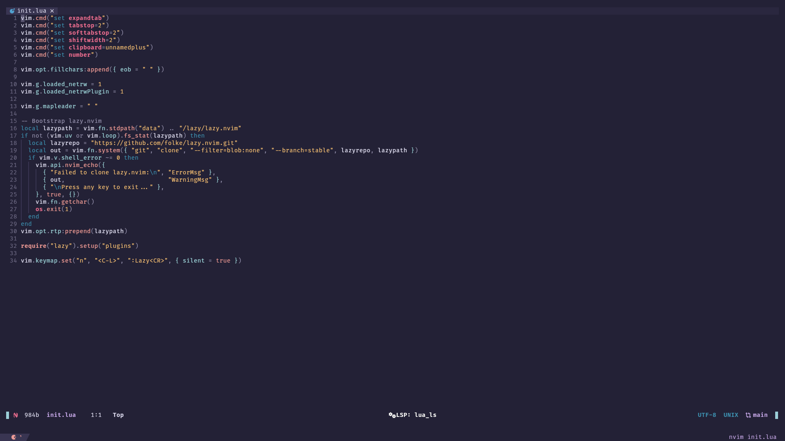
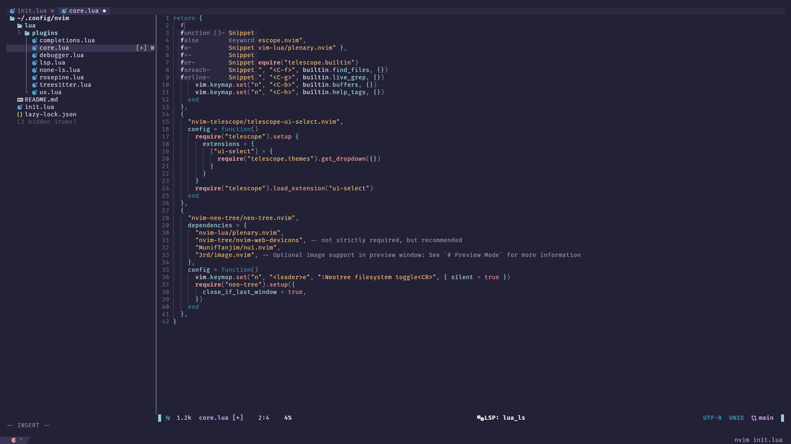
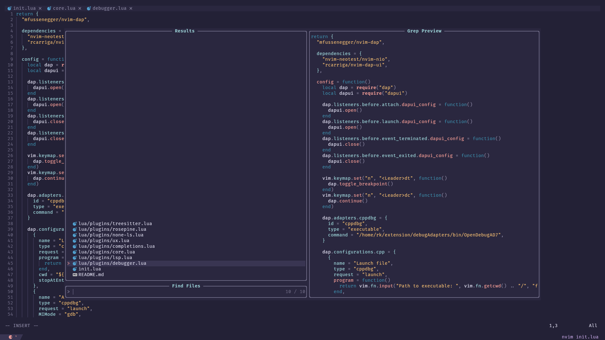

# Hey!!
ive decided to make a new and improved neovim config

i hope you like it !!

to install,
```
git clone https://github.com/SirErka/minimalist-neovim-v2
```





it *should* work with any neovim version >0.90
